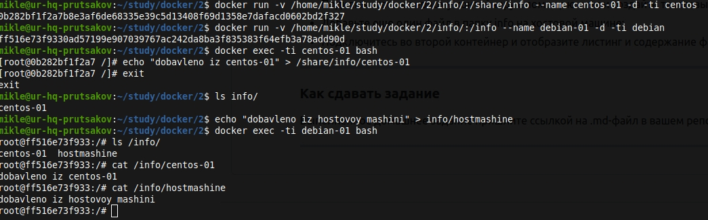

Задача 1
```
Посмотрите на сценарий ниже и ответьте на вопрос: "Подходит ли в этом сценарии использование докера? Или лучше подойдет виртуальная машина, физическая машина? Или возможны разные варианты?"
Детально опишите и обоснуйте свой выбор.
--
Сценарий:
    1.Высоконагруженное монолитное java веб-приложение;
    2.Go-микросервис для генерации отчетов;
    3.Nodejs веб-приложение;
    4.Мобильное приложение c версиями для Android и iOS;
    5.База данных postgresql используемая, как кэш;
    6.Шина данных на базе Apache Kafka;
    7.Очередь для Logstash на базе Redis;
    8.Elastic stack для реализации логирования продуктивного веб-приложения - три ноды elasticsearch, два logstash и две ноды kibana;
    9.Мониторинг-стек на базе prometheus и grafana;
    10.Mongodb, как основное хранилище данных для java-приложения;
    11.Jenkins-сервер.
```
        1. Лучше виртуальная машина, так как приложение монолитное и может потребовать значительных ресурсов при развертывании. Так же виртуальные машины позволят более быстро развернуть несколько таких приложений.
        2. Подходит Docker, так как нет особых условий для рабоыт сервиса, а данная технология позволит его быстро разворачивать и его клоны.
        3. Подходит Docker, так как нет особых условий для работы сервиса, а данная технология позволит быстро разворачивать его и его клоны.
        4. Подходит Docker, так как это приложение и нет требований к каким-либо ресурсам
        5. Лучше подойдет физическая машина, так как будет наименьшее количество слоев для доступа к физическим ресурсам
        6. На мой взгляд для транспортировки данных между сервисами можно использовать docker
        7. Вероятно подойдет виртуальная машина. Так как данные хранятся не на физических дисках, а в памяти.
        8. Для elasticsearch лучше использовать физический сервер так как много операций по обращению к дискам, для сервиса logstash можно использовать виртуальные машины, которые будут заняты обработкой данный передаваемых в elasticsearch, kibana же может быть развернута в docker так не требует особых ресурсов и является лишь инструментом для отображения данных.
        9. Можно использовать docker, так как нет особых требований к данным приложениям.
        10. Лучше использовать физический сервер, так как вероятно будет много операций чтения записи.
        11. Так как нет особых требований, то можно использовать docker

Задача 2
```
Сценарий выполения задачи:
    создайте свой репозиторий на докерхаб;
    выберете любой образ, который содержит апачи веб-сервер;
    создайте свой форк образа;
    реализуйте функциональность: запуск веб-сервера в фоне с индекс-страницей, содержащей HTML-код ниже:
    <html>
    <head>
    Hey, Netology
    </head>
    <body>
    <h1>I’m kinda DevOps now</h1>
    </body>
    </html>
    Опубликуйте созданный форк в своем репозитории и предоставьте ответ в виде ссылки на докерхаб-репо.
```
        https://hub.docker.com/repository/docker/prumyu/netology_05-virt-03-docker-usage_2
        
        Запуск контейнера:
        docker run --name netology_2 -p 8081:80 -d prumyu/netology_05-virt-03-docker-usage_2
Задача 3
```
Запустите первый контейнер из образа centos c любым тэгом в фоновом режиме, подключив папку info из текущей рабочей директории на хостовой машине в /share/info контейнера;
Запустите второй контейнер из образа debian:latest в фоновом режиме, подключив папку info из текущей рабочей директории на хостовой машине в /info контейнера;
Подключитесь к первому контейнеру с помощью exec и создайте текстовый файл любого содержания в /share/info ;
Добавьте еще один файл в папку info на хостовой машине;
Подключитесь во второй контейнер и отобразите листинг и содержание файлов в /info контейнера.
```
Смотри screen1.jpg


