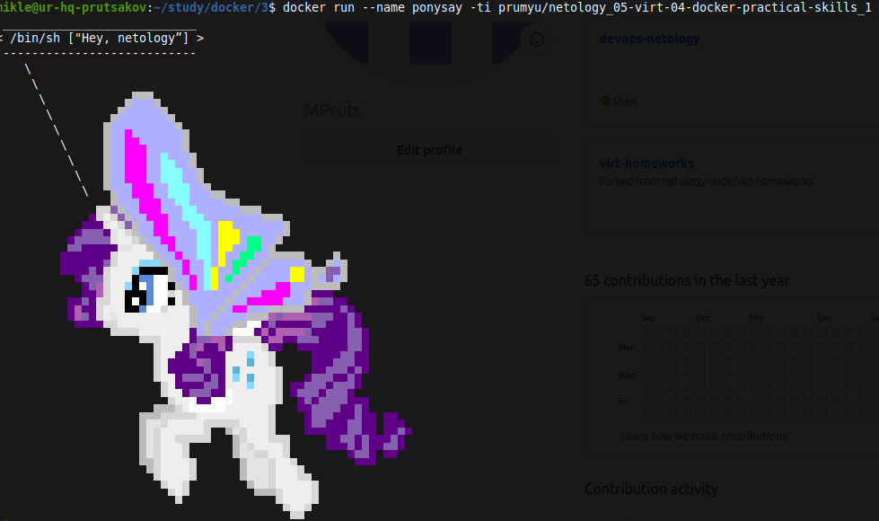
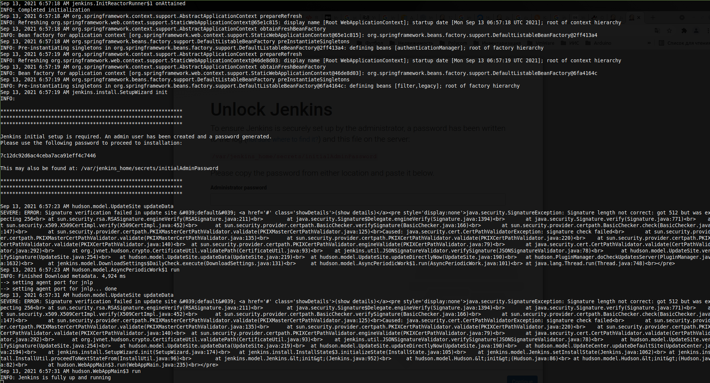
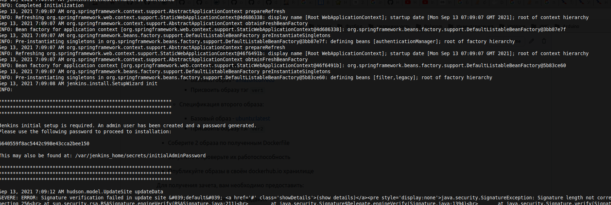
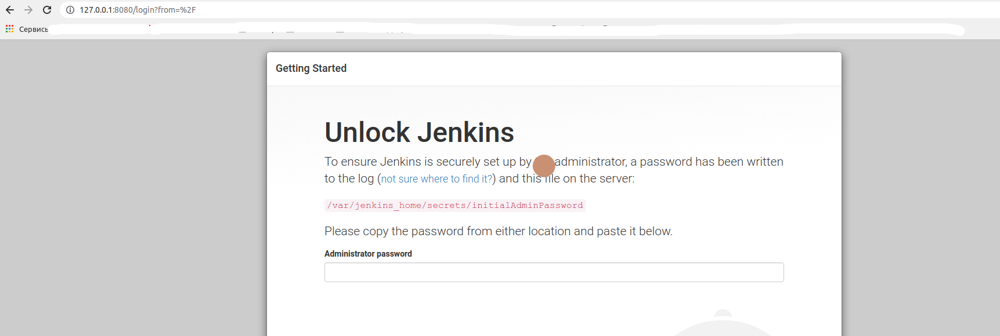
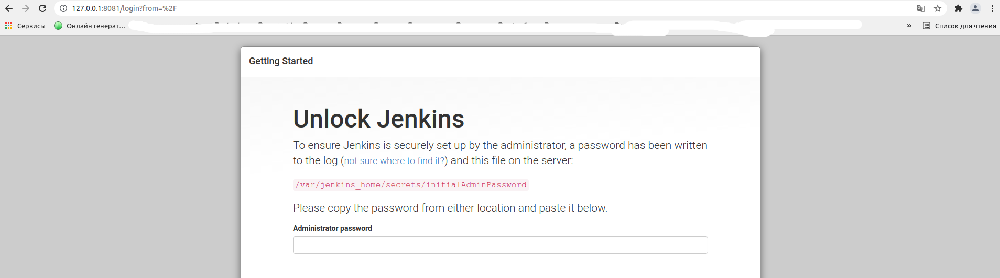
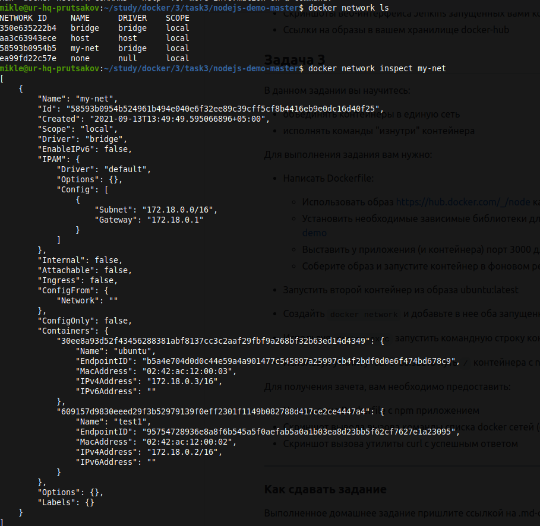
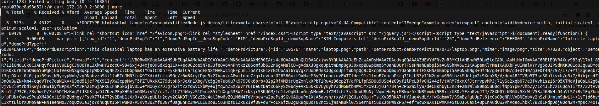

Задача 1 

В данном задании вы научитесь изменять существующие Dockerfile, адаптируя их под нужный инфраструктурный стек.

Измените базовый образ предложенного Dockerfile на Arch Linux c сохранением его функциональности.

```text
FROM ubuntu:latest

RUN apt-get update && \
    apt-get install -y software-properties-common && \
    add-apt-repository ppa:vincent-c/ponysay && \
    apt-get update
 
RUN apt-get install -y ponysay

ENTRYPOINT ["/usr/bin/ponysay"]
CMD ["Hey, netology”]
```

Для получения зачета, вам необходимо предоставить:
- Написанный вами Dockerfile
- Скриншот вывода командной строки после запуска контейнера из вашего базового образа
- Ссылку на образ в вашем хранилище docker-hub

    
[docker_ponysay](dockerfile_ponysay)

```
    FROM archlinux
     
    RUN pacman -Sy && pacman -S --noconfirm ponysay
    
    ENTRYPOINT ["/usr/bin/ponysay"]
    CMD ["Hey, netology”]
```


Ссылка на образ в хранилище docker-hub [netology_05-virt-04-docker-practical-skills_1](https://hub.docker.com/r/prumyu/netology_05-virt-04-docker-practical-skills_1)


Задача 2 

В данной задаче вы составите несколько разных Dockerfile для проекта Jenkins, опубликуем образ в `dockerhub.io` и посмотрим логи этих контейнеров.

- Составьте 2 Dockerfile:

    - Общие моменты:
        - Образ должен запускать [Jenkins server](https://www.jenkins.io/download/)
        
    - Спецификация первого образа:
        - Базовый образ - [amazoncorreto](https://hub.docker.com/_/amazoncorretto)
        - Присвоить образу тэг `ver1` 
    
    - Спецификация второго образа:
        - Базовый образ - [ubuntu:latest](https://hub.docker.com/_/ubuntu)
        - Присвоить образу тэг `ver2` 

- Соберите 2 образа по полученным Dockerfile
- Запустите и проверьте их работоспособность
- Опубликуйте образы в своём dockerhub.io хранилище

Для получения зачета, вам необходимо предоставить:
- Наполнения 2х Dockerfile из задания
- Скриншоты логов запущенных вами контейнеров (из командной строки)
- Скриншоты веб-интерфейса Jenkins запущенных вами контейнеров (достаточно 1 скриншота на контейнер)
- Ссылки на образы в вашем хранилище docker-hub


    Docker файлы:

   - [dockerfile_amazonlinux](dockerfile_amazonlinux)
   - [dockerfile_ubuntu](dockerfile_ubuntu)

    Скриншоты запуска:
Amazon Linux

Ubuntu


    Скриншоты web-интерфейса:
Amazon Linux

Ubuntu


    Ссылки на Docker Hub:
- [Amazon Linux Jenkins](https://hub.docker.com/repository/docker/prumyu/amazon-jenkins)
- [Ubuntu Jenkins](https://hub.docker.com/repository/docker/prumyu/ubuntu-jenkins)

Задача 3 

В данном задании вы научитесь:
- объединять контейнеры в единую сеть
- исполнять команды "изнутри" контейнера

Для выполнения задания вам нужно:
- Написать Dockerfile: 
    - Использовать образ https://hub.docker.com/_/node как базовый
    - Установить необходимые зависимые библиотеки для запуска npm приложения https://github.com/simplicitesoftware/nodejs-demo
    - Выставить у приложения (и контейнера) порт 3000 для прослушки входящих запросов  
    - Соберите образ и запустите контейнер в фоновом режиме с публикацией порта

- Запустить второй контейнер из образа ubuntu:latest 
- Создайть `docker network` и добавьте в нее оба запущенных контейнера
- Используя `docker exec` запустить командную строку контейнера `ubuntu` в интерактивном режиме
- Используя утилиту `curl` вызвать путь `/` контейнера с npm приложением  

Для получения зачета, вам необходимо предоставить:
- Наполнение Dockerfile с npm приложением
- Скриншот вывода вызова команды списка docker сетей (docker network cli)
- Скриншот вызова утилиты curl с успешным ответом

[dockerfile_task3](dockerfile_task3)
```
        FROM node
        
        ENV VCAP_APP_HOST 0.0.0.0
        
        WORKDIR /share
        
        RUN  git clone https://github.com/simplicitesoftware/nodejs-demo.git
        WORKDIR /share/nodejs-demo 
        RUN npm install
        
        EXPOSE 3000
        
        CMD npm start
```

