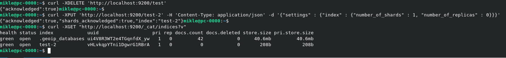

### Задача 1
[Dockerfile](Dockerfile)
```
FROM centos:7

WORKDIR /opt

EXPOSE 9200

RUN yum install -y wget curl && \
    wget https://artifacts.elastic.co/downloads/elasticsearch/elasticsearch-7.15.1-linux-x86_64.tar.gz && \
    tar xzf elasticsearch-7.15.1-linux-x86_64.tar.gz && \
    rm -rf elasticsearch-7.15.1-linux-x86_64.tar.gz && \
    mv elasticsearch-7.15.1 elasticsearch && \
    useradd elasticsearch && \
    usermod -aG wheel elasticsearch && \
    chown elasticsearch:elasticsearch -R /opt/elasticsearch && \
    mkdir /var/lib/data_elastic && \
    chown elasticsearch:elasticsearch -R /var/lib/data_elastic && \
    echo "node.name: netology_test" >> /opt/elasticsearch/config/elasticsearch.yml && \
    echo "path.data: /var/lib/data_elastic" >> /opt/elasticsearch/config/elasticsearch.yml && \
    echo "network.host: 0.0.0.0" >> /opt/elasticsearch/config/elasticsearch.yml && \
    echo 'discovery.seed_hosts: ["127.0.0.1"]' >> /opt/elasticsearch/config/elasticsearch.yml && \
    echo "cluster.initial_master_nodes: netology_test" >> /opt/elasticsearch/config/elasticsearch.yml

USER elasticsearch

CMD ["/opt/elasticsearch/bin/elasticsearch"]
```

Ссылка dockerhub на docker образ [prumyu/elasticsearch](https://hub.docker.com/repository/docker/prumyu/elasticsearch)


### Задача 2


```
Часть индексов кластера в состоянии green потому что у них отсутствуют реплики. Индексы в состоянии yellow потому что у них настройками предусмотрены создание реплик, а это не может быть выполнено потому что количество  нод - 1.
```
### Задача 3




