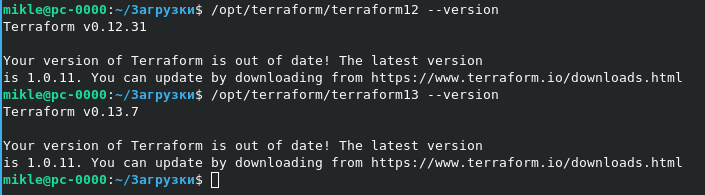

### Задача1

Ответы на вопросы:

1. Какой тип инфраструктуры будем использовать для этого проекта: изменяемый или не изменяемый?	
>  На мой взгляд лучше использовать не изменяемый тип инфраструктуры, так как это позволит более быстро и просто переходить с релизана релиз, а так же пр инеобходимости - выполнять откат.
2. Будет ли центральный сервер для управления инфраструктурой?	
>  Так как в компании используется Kubernetes и Docker, вероятно не используется центральный серверуправления.
3. Будут ли агенты на серверах?
>  Учитывая информацию из легенды можно сделать вывод что агенты на серверах не используются.
4. Будут ли использованы средства для управления конфигурацией или инициализации ресурсов? 
>  Так как планируется большое количество новых релизов или откатов за день, то для автоматизации развертывания удобно использовать систему контроля версий.

#### *Какие инструменты из уже используемых вы хотели бы использовать для нового проекта?*
Я бы использоватл следующие инструменты: 
* система контроля версий
* Docker
* Kubernetes
* Terraform
* Teamcity
* так же вероятно иногда использовал ansible и bash скрипты

#### *Хотите ли рассмотреть возможность внедрения новых инструментов для этого проекта?*
В данный момент сложно дать ответ на этот вопрос, но в ходе развития проекта не исключено использование новых инструментов.
### Задача2

### Задача3
