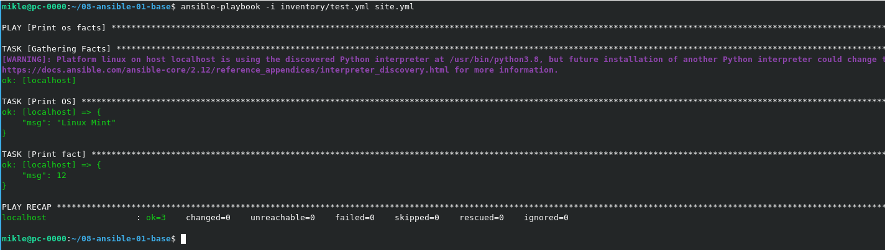
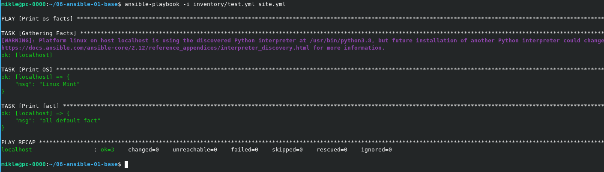
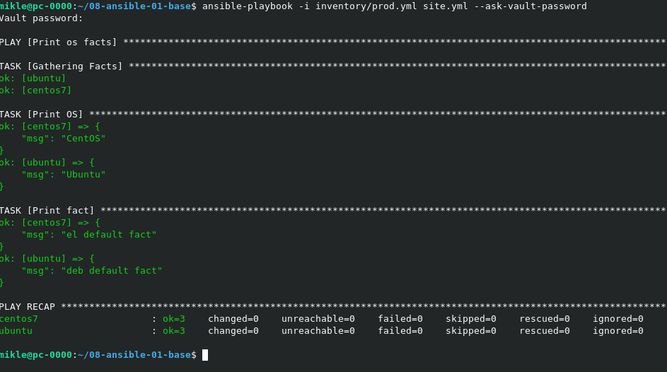
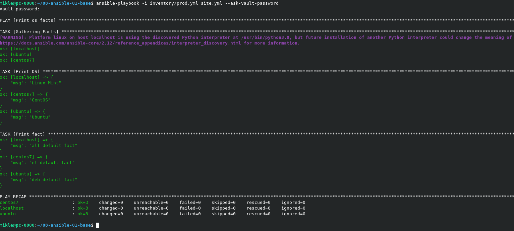

###  Основная часть
1. 
2. 
3. _
4. 
5-6. 
7. ```
   ansible-vault encrypt group_vars/el/examp.yml
   ansible-vault encrypt group_vars/deb/examp.yml
   ```
8. 
9. ```
   ansible-doc -t connection -l
   ```
10. Файл [prod.yml](https://github.com/MPruts/08-ansible-01-base/blob/bbf37dff5108134e55528d9474748528a000a543/inventory/prod.yml#L10) с добавленной группой хостов с именем local.
11. 