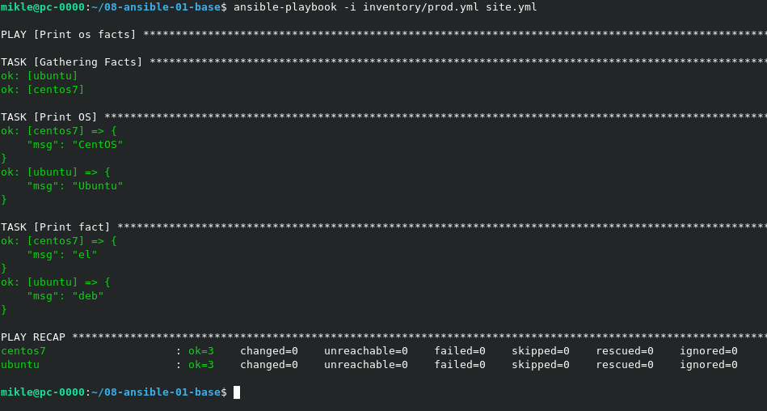

###  Основная часть
1 . <br> 

2 . <br> 

3 . <br> 

4 . <br> 

5-6 . <br> 

7 . <br> 
```
   ansible-vault encrypt group_vars/el/examp.yml
   ansible-vault encrypt group_vars/deb/examp.yml
```

8 . <br> 

9 . <br> 
```
   ansible-doc -t connection -l
```

10 . <br> Файл [prod.yml](https://github.com/MPruts/08-ansible-01-base/blob/bbf37dff5108134e55528d9474748528a000a543/inventory/prod.yml#L10) с добавленной группой хостов с именем local.

11 . <br> 