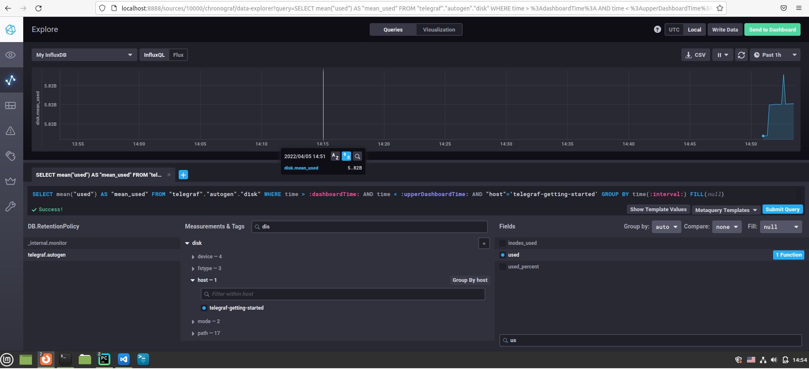

#### Задание 1
Плюсы Push-модели:
- данный метод позволяет определять на клиенте конечные точки куда должны быть переданы данные
- Более гибкая настройка отправки пакетов данных с  метриками: на клиентах определены четкие действия о том какие метрики и куда доставлять а так же с какой периодичностью, вне зависимости от того в каком состоянии в данный момент находится сервер
- Данные в большей степени переадаются агентами на сервер по UDP протоколу, что является менее затратным способом передачи данных, вследствии чего может вырости производительность сбора метрик
- агент может использовать для сбора метрик различные дополнительные ПО и скрипты, после выполнения которых информация будет собрана и в едином формате отправлена на сервер 
- информация на сервер о состоянии метрики может быть доставлена практически сразу после ее возникновения

Минусы Push-модели:
- отсутствие гарантированной доставки при использовании UDP
- если в момент отправки данных сервер был не доступен, то данные могут быть утеряны
- сервер не контролирует время прихода данных от клиентов, соответственно может возникнуть ситуация что в какой-то момент времени прийдет большой объем для обработки
- если на сервере отсуствуют какие-либо настройки авторизации агента или проверки подлинности, то данные могут быть сфольсифицированы и направлены на сервер с агента злоумыленника

Плюсы Pull-модели:
- Легче контролировать подлинность данных так как мы сами на сервере определяем откуда необходимо получать данные
- Можно настроить единый proxy-server до всех агентов с TLS это позволит дополнительно проводить проерку подлинности клиентов, с которых будут забираться данные
- Упрощенная отладка получения данных с агентов 
- периодичность получения данных определяется на сервере и контролируется сервером

Минусы Pull-модели:
- метрики полученные методом pull могут требовать дополнительной обрабоки на стороне сервера, перед их использованием в процессе мониторинга
- метод pull может использовать разные сервисы, ПО, дополнительные скрипты, для выполнения которых может потребоваться открытие дополнительных портов доступа на конечных агентах, что не очень безопасно
- если в момент получения данных агент был недоступен, то соответственноданных по агенту в базе не будет, они могут появиться только при следующем очередном опросе агентов
- информация, получаемая сервером может быть устаревшей на момент ее получения, соответственно могут быть пропущены реакции, которые долны были наступить при появлении тех или иных метрик

#### Задание 2

- Prometheus - гибридная система, умеет работать по push и pull
- TICK - гибридная система, умеет работать по push и pull
- Zabbix - гибридная система, умеет работать по push и pull
- VictoriaMetrics - гибридная система, умеет работать по push и pull
- Nagios - работает по pull модели

#### Задание 3

#### Задание 4

#### Задание 5
