##### Задание 1
Установленные nodes и pods
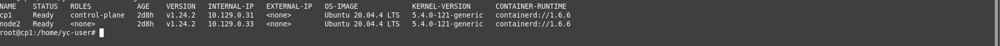

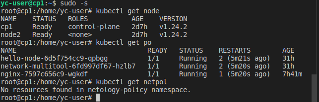

Выполнение запроса к pod hellow world из вне и внутри кластера

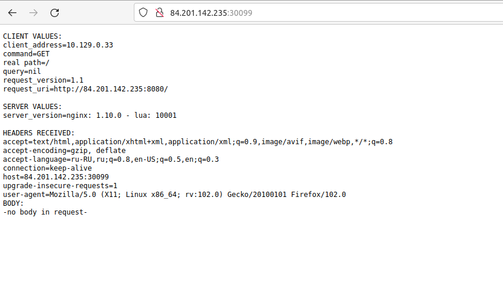

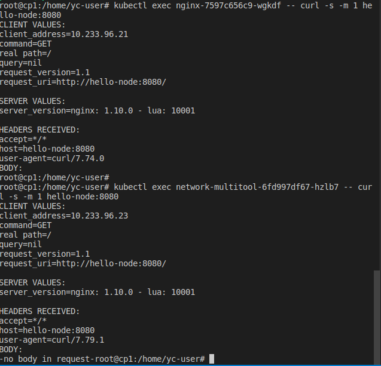

Содержимое файлов политик

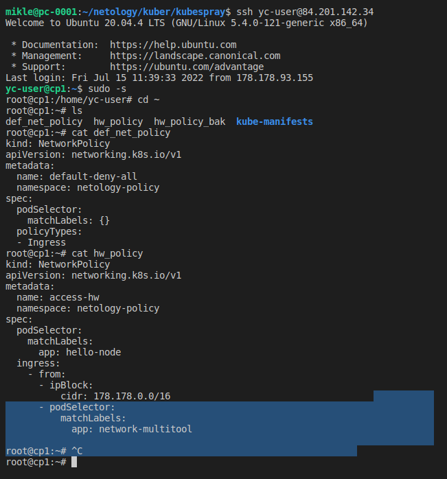

Применение политики по умолчанию: закрыт полностью весь доступ

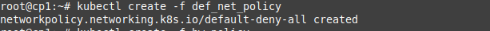

Проверка факта отсутствия доступа из вне и внутри кластера после применения политики по умолчанию

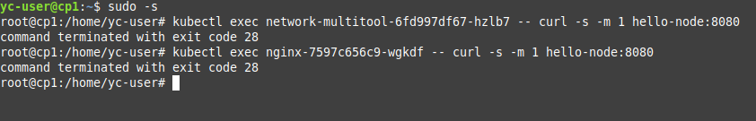

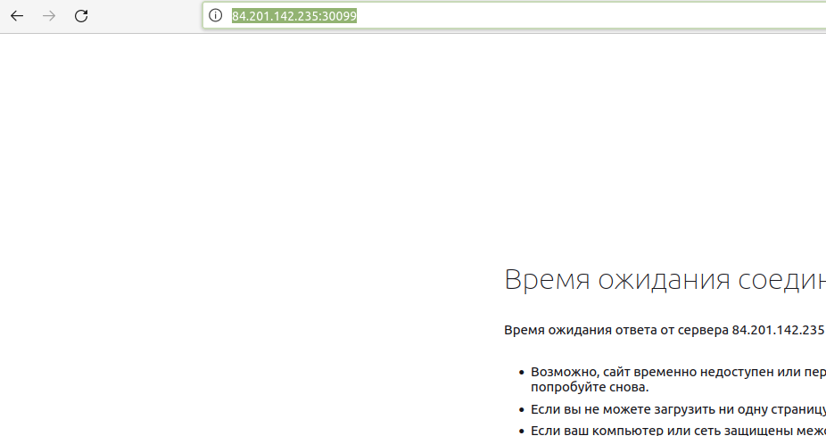

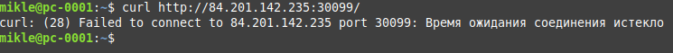

Применение политики разрешающей доступ к поду hellow world с определенного диапазона адресов, а так же разрешение достпу с подов с labels network-multitool

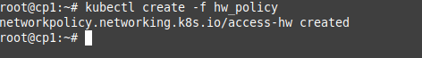

Вывод списка примененных политик

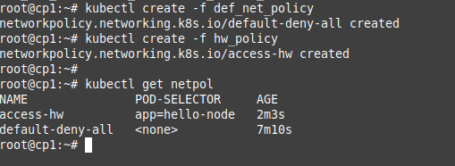

Проверка доступа к поду hello word из вне и внутри кластера: доступ из вне проходит с адресов сети 178.178.0.0/16, доступ внутри кластера проходит с подов с labels network-multitool, доступ с подом с labels nginx не проходит

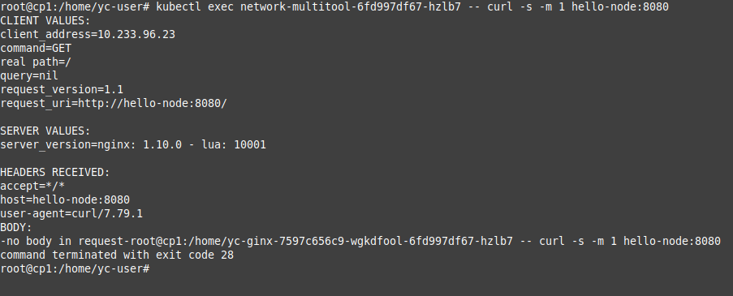

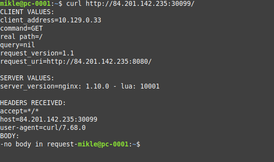

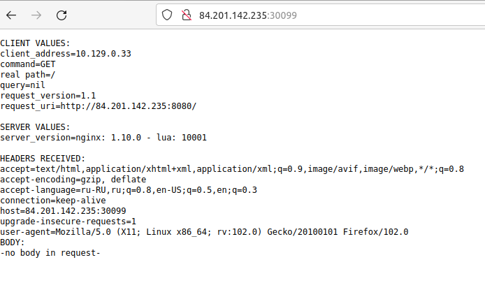

##### Задание 2
Список нод, ipPool и profile полученный с использованием crioctl

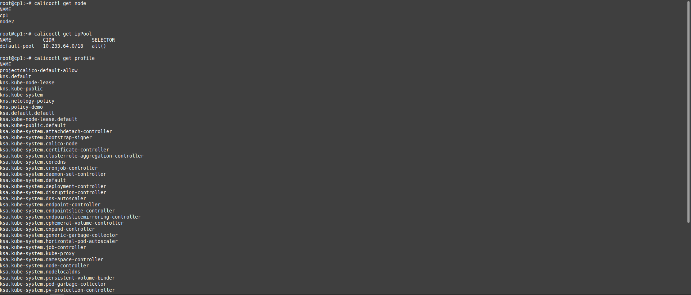

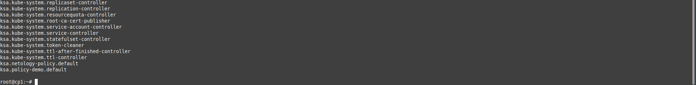