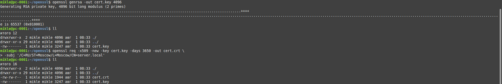
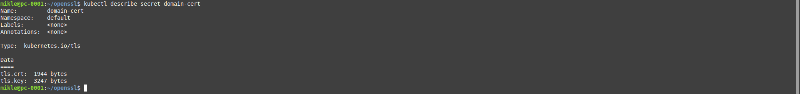
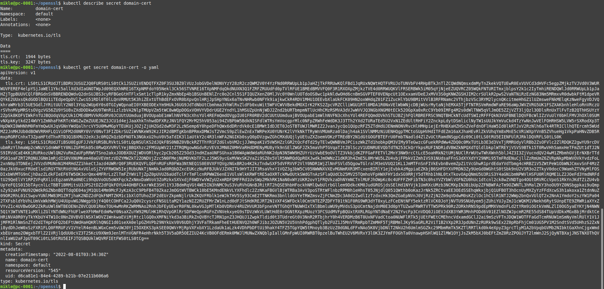
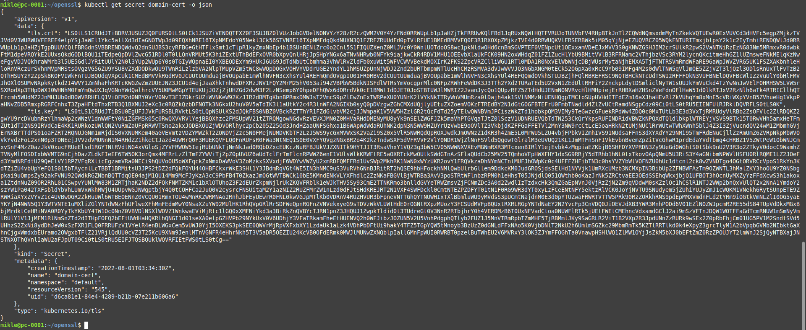
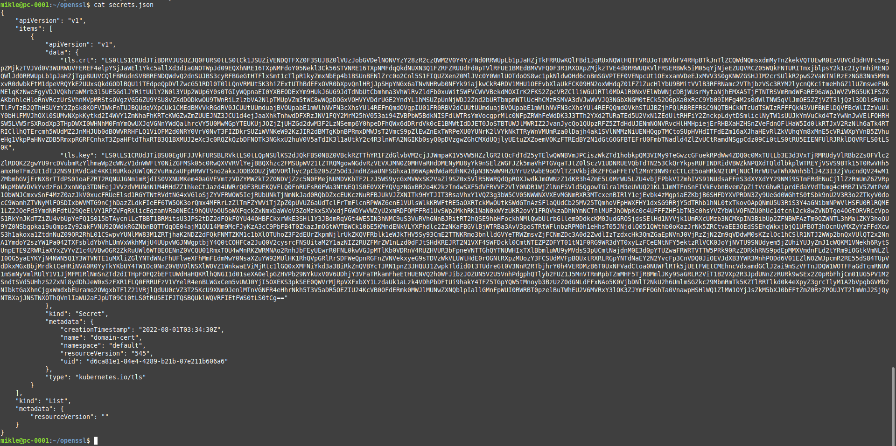
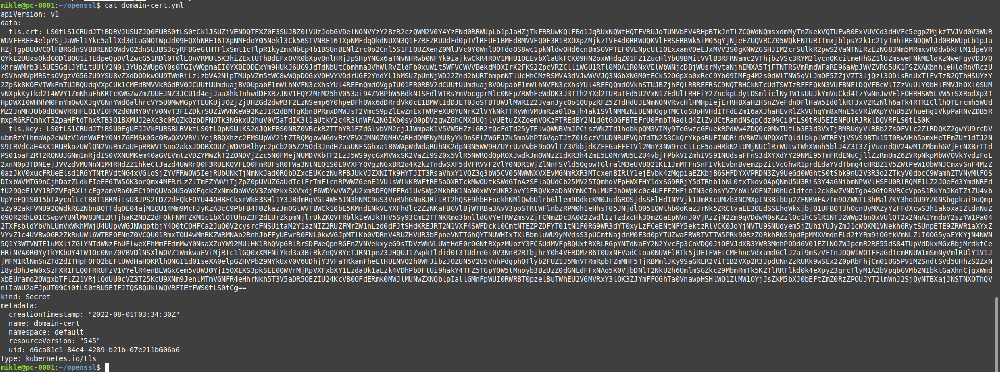
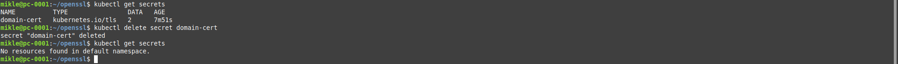
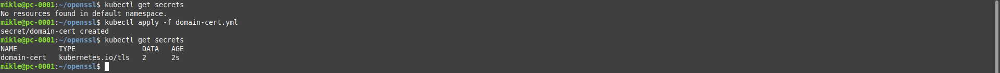

### Задание 1

##### Создать секрет

##### Просмотреть список секретов

##### Просмотреть секрет

##### Получить информацию в формате YAML и/или JSON

###### YAML

###### JSON

##### Выгрузить секрет и сохранить его в файл

##### Удалить секрет

##### Загрузить секрет из файла

