### Задание 1
Для создания инфраструктуры необходимо чтобы присутствовали переменные среды:
1. export YC_TOKEN=$(yc iam create-token)
2. export YC_CLOUD_ID=$(yc config get cloud-id)
3. export YC_FOLDER_ID=$(yc config get folder-id)

Так же необходимо скачать файл [main.tf](./terraform-files/main.tf) из каталога tesrraform.

Перейти в каталог с файлом main.tf и выполнить команду `terraform apply`

#### Применение файла конфигурации terrafom

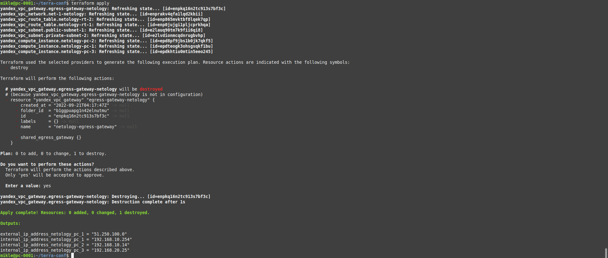

#### Созданная инфраструктура в YandexCloud

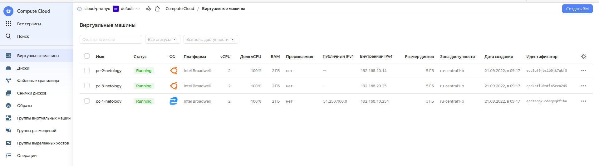

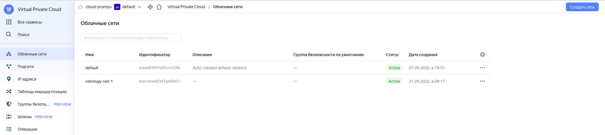

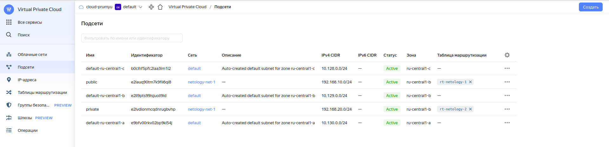

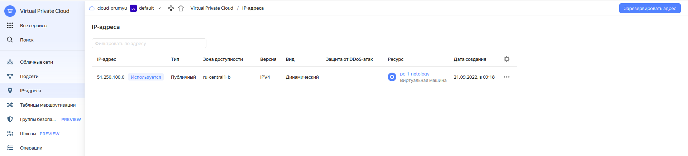

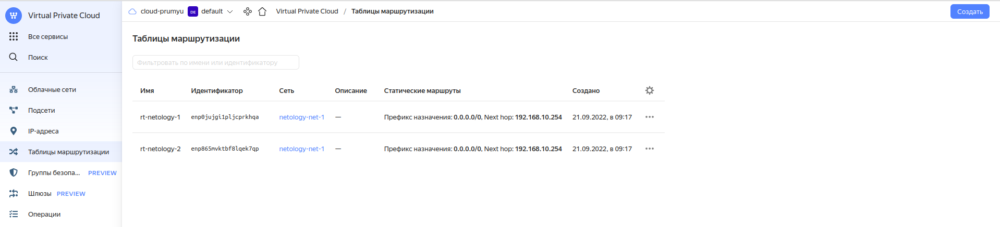

#### Подключение к машине NAT-инстанс

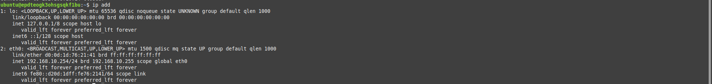

#### Подключение к машине из сети Public и прверка доступа в интернет

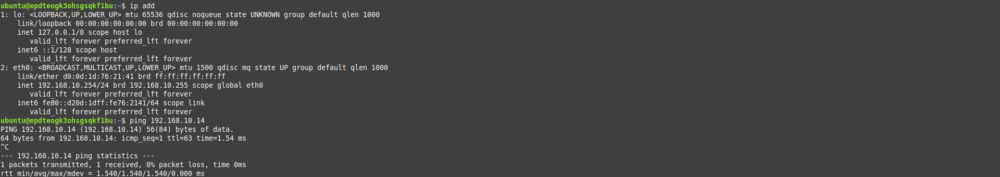

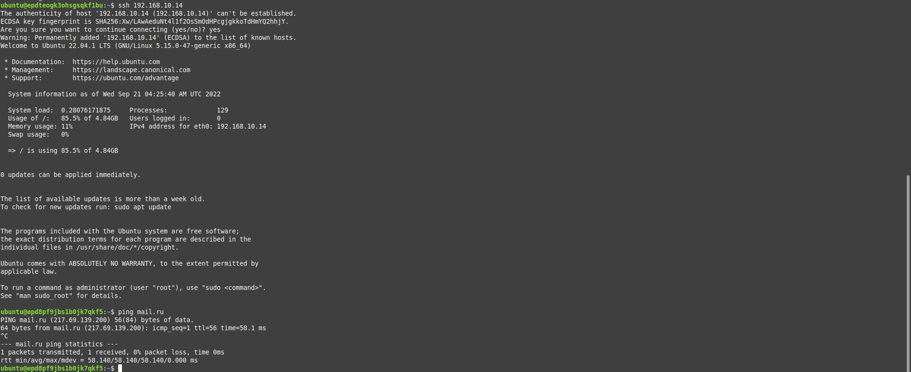

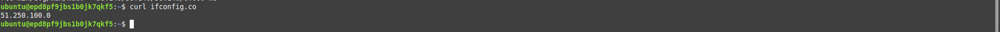

#### Подключение к машине из сети Private и прверка доступа в интернет

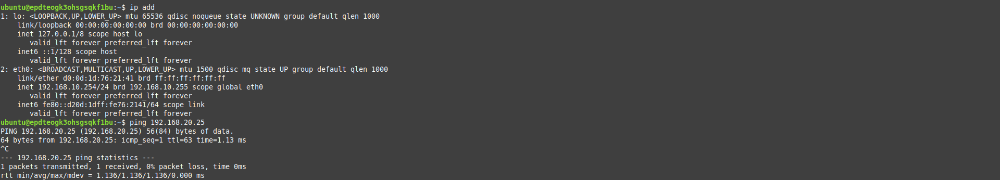

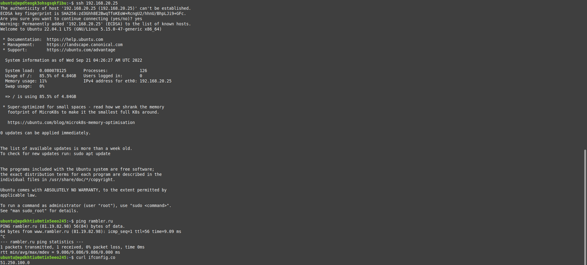

#### Проверка достпности машин между сетями Public и Private

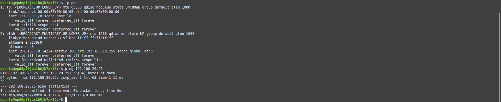

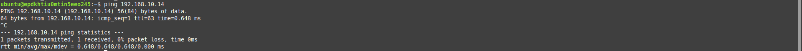

